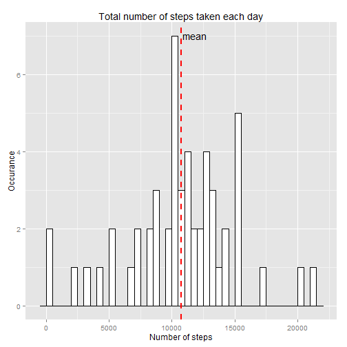
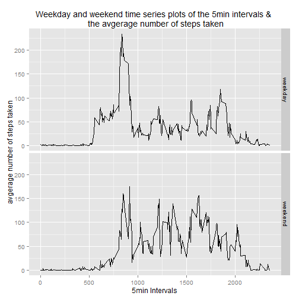

# Introduction

It is now possible to collect a large amount of data about personal movement using activity monitoring devices such as a Fitbit, Nike Fuelband, or Jawbone Up. These type of devices are part of the “quantified self” movement – a group of enthusiasts who take measurements about themselves regularly to improve their health, to find patterns in their behavior, or because they are tech geeks. But these data remain under-utilized both because the raw data are hard to obtain and there is a lack of statistical methods and software for processing and interpreting the data.

This assignment makes use of data from a personal activity monitoring device. This device collects data at 5 minute intervals through out the day. The data consists of two months of data from an anonymous individual collected during the months of October and November, 2012 and include the number of steps taken in 5 minute intervals each day.

# Data

The data for this assignment is located in "activity.csv" file that has to be located in same working dorectory in order for the scripts to be able to process it.

The variables included in this dataset are:

* **steps**: Number of steps taking in a 5-minute interval (missing values are coded as NA)

* **date**: The date on which the measurement was taken in YYYY-MM-DD format

* **interval**: Identifier for the 5-minute interval in which measurement was taken

The dataset is stored in a comma-separated-value (CSV) file and there are a total of 17,568 observations in this dataset.

# Assignment

## Loading and preprocessing the data

**Load data and define column classes**

```r
activity<-read.csv("activity.csv", 
                   colClasses = c("integer", 
                                  "POSIXct", 
                                  "integer"
                                  )
                   )
```

**Load packages necessary to process data**

```r
library(ggplot2)
library(dplyr)
```

## What is mean total number of steps taken per day?
As per assignement specification for this part  the assignment we can ignore the missing values in the dataset.
  
**Calculate the total number of steps taken per day.**

```r
steps_by_date<-aggregate(steps~date, activity, sum)
```

**Make a histogram of the total number of steps taken each day.**

```r
steps_by_date_plot<-ggplot(steps_by_date, 
                           aes(x=steps)
                           )
steps_by_date_plot + geom_histogram(binwidth=500, 
                                    colour="black", 
                                    fill="white"
                                    ) +
                     ggtitle("Total number of steps taken each day") +
                     xlab("Number of steps") +
                     ylab("Occurance") +
                     geom_vline(aes(xintercept=mean(steps_by_date$steps)),  
                                color="red", 
                                linetype="dashed", 
                                size=1
                                ) + 
                     annotate("text",(x=mean(steps_by_date$steps)+100),y=7,label="mean",hjust=0)
```

 

**Calculate and report the mean and median of the total number of steps taken per day.**
  

```r
steps_by_date_mean<-mean(steps_by_date$steps)
steps_by_date_median<-median(steps_by_date$steps)
```

* mean of the total number of steps taken per day is **1.0766189 &times; 10<sup>4</sup>**
* median of the total number of steps taken per day is **10765**

## What is the average daily activity pattern?
**Make a time series plot (i.e. type = "l") of the 5-minute interval (x-axis) and the average number of steps taken, averaged across all days (y-axis).**


```r
mean_steps<-aggregate(steps~interval, activity, mean)
names(mean_steps)<-c("interval", "steps_int_mean")

mean_steps_plot<-ggplot(mean_steps, 
                        aes(x = interval, 
                            y = steps_int_mean)
                        )
mean_steps_plot + geom_line() +
                  ggtitle("Time series plot of the 5min intervals & \n the avgerage number of steps taken") +
                  xlab("5min Intervals") +
                  ylab("avgerage number of steps taken")
```

 

**Which 5-minute interval, on average across all the days in the dataset, contains the maximum number of steps?**


```r
# Find the 5-minute interval with max number of steps and report the average number of steps for this interval
max_int<-mean_steps$interval[which.max(mean_steps$steps_int_mean)]
max_int_steps<-mean_steps$steps_int_mean[which.max(mean_steps$steps_int_mean)]
```
The 5-minute interval with max number of steps is: **835**. Average number of steps in this interval is **206.1698113**.

## Imputing missing values

Note that there are a number of days/intervals where there are missing values (coded as NA). The presence of missing days may introduce bias into some calculations or summaries of the data.

**Calculate and report the total number of missing values in the dataset (i.e. the total number of rows with NAs).**

Initial review of data suggests NA values are present only in the "steps" column of the original dataset.


```r
# Calculate number of NA values in in the "steps" column
activity_NA_steps<-sum(is.na(activity$steps))
```
Total number of NA values in in the "steps" column is: **2304**.


```r
# Calculate total number of NA values across all columns to check that there are no other NA values:
activity_NA_total<-sum(is.na(activity$steps), 
                       is.na(activity$date), 
                       is.na(activity$interval)
                       )
```
Total number of NA values across all columns is: **2304**.

**Devise a strategy for filling in all of the missing values in the dataset. The strategy does not need to be sophisticated. For example, you could use the mean/median for that day, or the mean for that 5-minute interval, etc.**

We will fill out all missing steps data with mean values for that 5-minute interval. We have calculated the daily 5-min intervals "mean_steps" dataset.

```r
head(mean_steps)
```

```
##   interval steps_int_mean
## 1        0      1.7169811
## 2        5      0.3396226
## 3       10      0.1320755
## 4       15      0.1509434
## 5       20      0.0754717
## 6       25      2.0943396
```

**Create a new dataset that is equal to the original dataset but with the missing data filled in.**

We will use the "mean_steps" dataset to replace the NA values in "steps" column. This way we will create a new dataset and call it "activity_noNA"

```r
activity_stepsmean<-merge(activity, mean_steps, by="interval")
activity_stepsmean$steps[is.na(activity_stepsmean$steps)]<- activity_stepsmean$steps_int_mean[is.na(activity_stepsmean$steps)]
activity_noNA<-activity_stepsmean[,1:3]
```

Test that datasets are equal and that "activity_noNA" dataset does not contain NA values in "steps" column:

```r
str(activity)
```

```
## 'data.frame':	17568 obs. of  3 variables:
##  $ steps   : int  NA NA NA NA NA NA NA NA NA NA ...
##  $ date    : POSIXct, format: "2012-10-01" "2012-10-01" ...
##  $ interval: int  0 5 10 15 20 25 30 35 40 45 ...
```

```r
str(activity_noNA)
```

```
## 'data.frame':	17568 obs. of  3 variables:
##  $ interval: int  0 0 0 0 0 0 0 0 0 0 ...
##  $ steps   : num  1.72 0 0 0 0 ...
##  $ date    : POSIXct, format: "2012-10-01" "2012-11-23" ...
```

```r
activity_noNA_NA_total<-sum(is.na(activity_noNA$steps))
```
There are **0** NA values in "activity_noNA" dataset.

**Make a histogram of the total number of steps taken each day and Calculate and report the mean and median total number of steps taken per day. Do these values differ from the estimates from the first part of the assignment? What is the impact of imputing missing data on the estimates of the total daily number of steps?**

```r
steps_by_date_noNA<-aggregate(steps~date, activity_noNA, sum)

steps_by_date_noNA_plot<-ggplot(steps_by_date_noNA, 
                                aes(x=steps)
                                )
steps_by_date_noNA_plot + geom_histogram(binwidth=500, 
                                         colour="black", 
                                         fill="white"
                                         ) +
                          ggtitle("Total number of steps taken each day \n (with estimated missing data)") +
                          xlab("Number of steps") +
                          ylab("Occurance") +
                          geom_vline(aes(xintercept=mean(steps_by_date$steps)),  
                                     color="red", 
                                     linetype="dashed", 
                                     size=1
                                     ) + 
                          annotate("text",(x=mean(steps_by_date_noNA$steps)+200),y=12,label="mean",hjust=0)
```

 

```r
steps_by_date_noNA_mean<-mean(steps_by_date_noNA$steps)
steps_by_date_noNA_median<-median(steps_by_date_noNA$steps)      
```

* mean of the total number of steps taken per day is **1.0766 &times; 10<sup>4</sup>**.
* median of the total number of steps taken per day is **1.0766 &times; 10<sup>4</sup>**.

Mean value stayed the same, median value increased and is now equal to mean.

The impact of imputing missing data on the estimates of the total daily number of steps is that the total daily number of steps has increased from **570608** without imputing to **6.5673751 &times; 10<sup>5</sup>** with missing data imputed.

## Are there differences in activity patterns between weekdays and weekends?

**Create a new factor variable in the dataset with two levels – “weekday” and “weekend” indicating whether a given date is a weekday or weekend day.** 
*Note that the way factor renaming strategy is applied here works only for locale set to  "Slovenian_Slovenia.1250"*

```r
activity_noNA_days<-cbind(activity, days=c(weekdays(activity$date, abbreviate = FALSE)))
levels(activity_noNA_days$days)<- c("weekday",
                                    "weekend",
                                    "weekday",
                                    "weekday",
                                    "weekend",
                                    "weekday",
                                    "weekday"
                                    )
```


```r
head(activity_noNA_days)
```

```
##   steps       date interval    days
## 1    NA 2012-10-01        0 weekday
## 2    NA 2012-10-01        5 weekday
## 3    NA 2012-10-01       10 weekday
## 4    NA 2012-10-01       15 weekday
## 5    NA 2012-10-01       20 weekday
## 6    NA 2012-10-01       25 weekday
```

Number of weekday and weekend days:

```r
summary(activity_noNA_days$days)
```

```
## weekday weekend 
##   12960    4608
```

**Make a panel plot containing a time series plot (i.e. type = "l") of the 5-minute interval (x-axis) and the average number of steps taken, averaged across all weekday days or weekend days (y-axis).**

```r
mean_steps_days<-aggregate(steps~interval+days, activity_noNA_days, mean)

mean_steps_days_plot<-ggplot(mean_steps_days, 
                             aes(x = interval, 
                                 y = steps)
                             )
mean_steps_days_plot + geom_line() + 
                       ggtitle("Weekday and weekend time series plots of the 5min intervals & \n the avgerage number of steps taken") +
                       xlab("5min Intervals") +
                       ylab("avgerage number of steps taken") + 
                       facet_grid(days ~ .)
```

 
